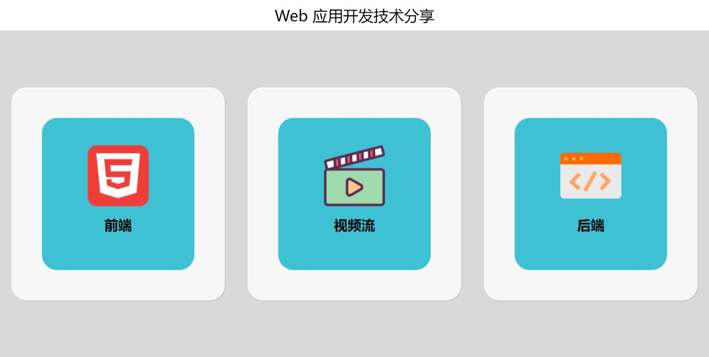

# 一. 准备

### 1. 打开 cmd 输入

```shell
git clone https://github.com/gitcaka/web-share.git
```

### 2. 安装 Python 软件包：Flask, opencv-python

已安装可省略

```shell
pip install Flask
pip install opencv-python
```

### 3. 运行

```shell
python app.py
```

### 4. 访问 http://127.0.0.1:5000/



# 二. RTSP→Web

### 1. 捕获 RTSP 地址逐帧输出到网页的函数 `gen_frames()`

```python
def gen_frames(address):
    # 从摄影机逐帧生成
    camera = cv2.VideoCapture(address)
    while True:
        # 逐帧捕获
        success, frame = camera.read()  # 读取相机帧
        if not success:
            pass
        else:
            ret, buffer = cv2.imencode('.jpg', frame)
            frame = buffer.tobytes()
            yield (b'--frame\r\n'
                   b'Content-Type: image/jpeg\r\n\r\n' + frame + b'\r\n')  # 逐帧显示结果

```

### 2. 输入电脑摄像头，输出到网页显示

HTML

```html

```

Python

```python
@app.route('/video_feed_0')
def video_feed_0():
    return Response(gen_frames(0), mimetype='multipart/x-mixed-replace; boundary=frame')
```

### 3. 输入手机摄像头，输出到网页显示

HTML

```html

```

Python

```python
phone_rtsp_url = 'rtsp://192.168.117.106:8554/live'  # 手机摄像头RTSP地址
@app.route('/video_feed_1')
def video_feed_1():
    return Response(gen_frames(phone_rtsp_url), mimetype='multipart/x-mixed-replace; boundary=frame')
```

### 4. 输入 Paddle 检测后 RTSP 地址，输出到网页显示

HTML

```html

```

Python

```python
paddle_out_rtsp_url = 'rtsp://localhost:8554/output'  # Paddle检测后输出的RTSP地址
@app.route('/video_feed_3')
def video_feed_3():
    return Response(gen_frames(paddle_out_rtsp_url), mimetype='multipart/x-mixed-replace; boundary=frame')
```

# 三. 模型→RTSP
找到 `cv2.imshow()` 函数，并替换  
可参考一下示例。
### 1. 更改前
可以看出是循环执行`cv2.imshow('Mask Detection', im)`实现窗口可视化和循环执行`writer.write(im)`逐帧保存为视频
```python
index = 1
while (1):
    ret, frame = capture.read()
    if not ret:
        continue
    print('detect frame: %d' % (index))
    index += 1
    results = self.predict_image([frame[:, :, ::-1]], visual=False)
    im = visualize_box_mask(frame, results, self.pred_config.labels, threshold=self.threshold)
    im = np.array(im)
    writer.write(im)
    if camera_id != -1:
        cv2.imshow('Mask Detection', im)
        if cv2.waitKey(1) & 0xFF == ord('q'):
            break
```

### 2. 更改后
此处我保留了`cv2.imshow()`，而是通过判断用户有没有输入`pushurl`参数来决定是否推流到RTSP服务器。  
`pushstream`是推流到RTSP服务器的子进程，`pushstream.stdin.write(im.tobytes())`将结果推流到RTSP服务器。  
```python
if FLAGS.pushurl:
    pushurl = os.path.join(FLAGS.pushurl, 'output')
    print("the result will push stream to url:{}".format(pushurl))
    command = [
        'ffmpeg', '-y', '-f', 'rawvideo', '-vcodec', 'rawvideo', '-pix_fmt',
        'bgr24', '-s', "{}x{}".format(width, height), '-r', str(fps), '-i',
        '-', '-pix_fmt', 'yuv420p', '-f', 'rtsp', pushurl
    ]
    pushstream = subprocess.Popen(command, stdin=subprocess.PIPE)
else:
    fourcc = cv2.VideoWriter_fourcc(*'mp4v')
    writer = cv2.VideoWriter(out_path, fourcc, fps, (width, height))
    
index = 1
while (1):
    ret, frame = capture.read()
    if not ret:
        continue
    print('detect frame: %d' % (index))
    index += 1
    results = self.predict_image([frame[:, :, ::-1]], visual=False)
    im = visualize_box_mask(frame, results, self.pred_config.labels, threshold=self.threshold)
    im = np.array(im)
    if FLAGS.pushurl:
        pushstream.stdin.write(im.tobytes())
    else:
        writer.write(im)
        if camera_id != -1:
            cv2.imshow('Mask Detection', im)
            if cv2.waitKey(1) & 0xFF == ord('q'):
                break
```